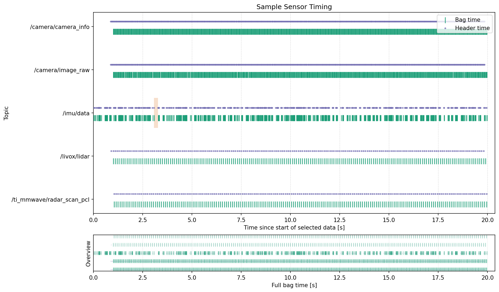
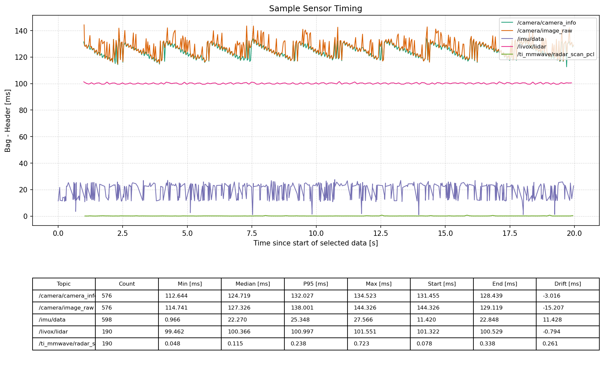
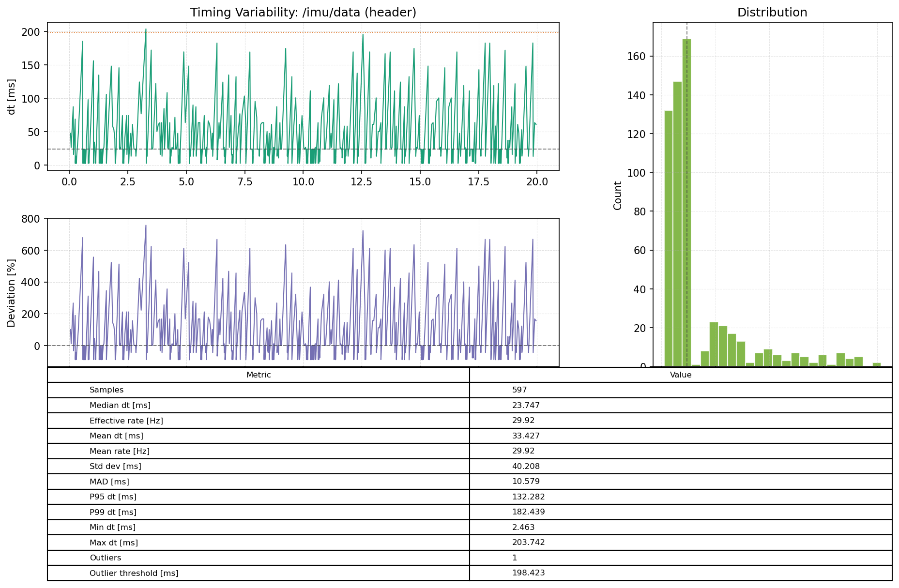

# sensor_timing_viz

ROS 2 package for inspecting rosbag sensor timing with both static exports and an interactive GUI.

## Features

- Timing Diagram with one row per topic
- Explicit `bag` or `header` timing basis selection in the Timing Diagram
- Gap detection and summary statistics
- Bag-Header Offset plotting
- Timing Variability plots
- Rosbag loading through the `rosbag2_py` API
- Interactive GUI with:
  - topic filtering
  - overview timeline window
  - zoom/pan tools
  - subsection loading with `--start` and `--end`
  - single-file HTML report export

## Build

```bash
cd <your_ros2_workspace>
source /opt/ros/<your_distro>/setup.bash
colcon build --packages-select sensor_timing_viz
source install/setup.bash
```

## GUI

Open the viewer on a full bag:

```bash
ros2 run sensor_timing_viz sensor_timing_gui --bag /path/to/your_bag
```

Open only a subsection of the bag:

```bash
ros2 run sensor_timing_viz sensor_timing_gui --bag /path/to/your_bag --start 0.0 --end 15.0
```

## CLI

Create a Timing Diagram image:

```bash
ros2 run sensor_timing_viz sensor_timing_cli /path/to/your_bag --start 0.0 --end 15.0 -o timing.png
```

Create a Timing Diagram image and a full single-file HTML report:

```bash
ros2 run sensor_timing_viz sensor_timing_cli /path/to/your_bag --start 0.0 --end 15.0 -o timing.png --html-report timing_report.html
```

## Example Plots

### Timing Diagram



### Bag-Header Offset



### Timing Variability



## Notes

- `header` timing uses `header.stamp`
- the Timing Diagram and its summary table share one timing-basis control
- the Timing Variability tab has its own independent basis control
- bag loading uses the rosbag2 Python API, so supported formats depend on the storage plugins available in your ROS 2 installation
- the rate columns use effective average rate instead of `1 / median_dt`

## Module Layout

- `sensor_timing_viz.models`
  Shared dataclasses such as `AnalysisOptions`, `AnalysisResult`, and topic summary types.
- `sensor_timing_viz.bag_io`
  Rosbag2 bag discovery, message loading, and time-window selection through `rosbag2_py`.
- `sensor_timing_viz.analysis`
  Timing statistics, gap detection, offset summaries, and variability summaries.
- `sensor_timing_viz.plotting`
  Matplotlib rendering for the Timing Diagram, Bag-Header Offset, and Timing Variability views.
- `sensor_timing_viz.reporting`
  Single-file HTML report export.
- `sensor_timing_viz.args`
  Shared parser helpers for the CLI and GUI entrypoints.
